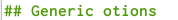
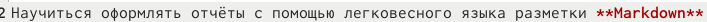
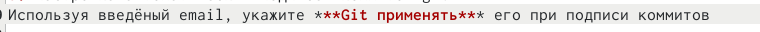
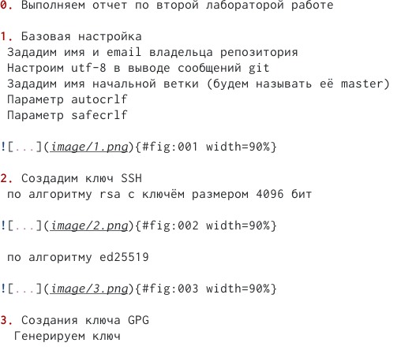
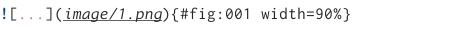

---
## Front matter
lang: ru-RU
title: Лабораторная работа №3 
subtitle: Работа с Markdown
author:
  - Матвеева А.С
institute:
  - Российский университет дружбы народов, Москва, Россия

## i18n babel
babel-lang: russian
babel-otherlangs: english

## Formatting pdf
toc: false
toc-title: Содержание
slide_level: 2
aspectratio: 169
section-titles: true
theme: metropolis
header-includes:
 - \metroset{progressbar=frametitle,sectionpage=progressbar,numbering=fraction}
 - '\makeatletter'
 - '\beamer@ignorenonframefalse'
 - '\makeatother'
---

# Информация

## Докладчик

:::::::::::::: {.columns align=center}
::: {.column width="70%"}

  * Матвеева Анастасия Сергеевна 
  * НБИ-02-22
  * РУДН 

:::
::: {.column width="30%"}

:::
::::::::::::::

## Цели и задачи

- Научиться оформлять отчёты с помощью легковесного языка разметки Markdown

## Этапы работы

1. Чтобы создать заголовок, используйте знак ( # ), например

{#fig:001 width=90%}

##

2.Чтобы задать для текста полужирное начертание, заключите его в двойные звездочки

{#fig:002 width=90%}

##

3. Создаем еще один репозиторий, называем его нашим никнеймом в гитхабе

{#fig:005 width=90%}

##

4. Чтобы задать для текста полужирное и курсивное начертание, заключите его в тройные
звездочки 

{#fig:006 width=90%}

##

5. Упорядоченный список можно отформатировать с помощью соответствующих цифр

{#fig:003 width=90%}

##

6. Синтаксис Markdown для встроенной ссылки состоит из части [link text] , представ-
ляющей текст гиперссылки, и части (file-name.md) – URL-адреса или имени файла,
на который дается ссылка

{#fig:004 width=90%}

## Вывод 

- Мы освоили макдовн, мы молодцы 

:::

