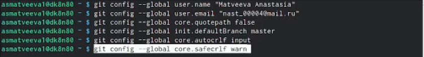
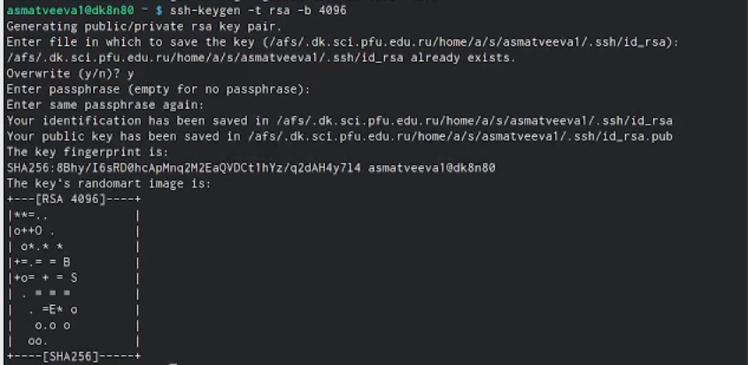
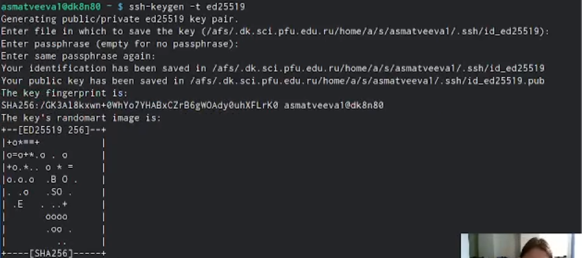
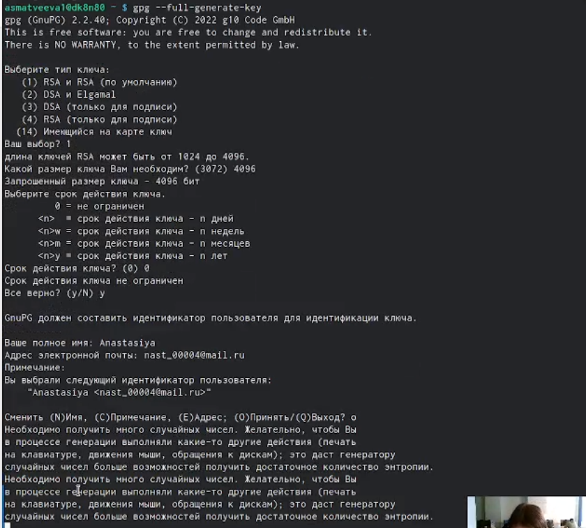
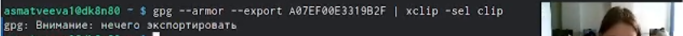
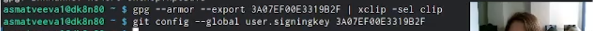
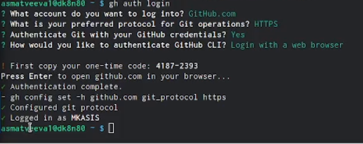
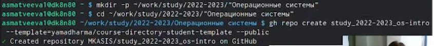

---
## Front matter
title: "Лабораторная рбота №3"
subtitle: "Markdown"
author: "Матвеева Анастасия Сергеевна"

## Generic otions
lang: ru-RU
toc-title: "Содержание"

## Bibliography
bibliography: bib/cite.bib
csl: pandoc/csl/gost-r-7-0-5-2008-numeric.csl

## Pdf output format
toc: true # Table of contents
toc-depth: 2
lof: true # List of figures
lot: true # List of tables
fontsize: 12pt
linestretch: 1.5
papersize: a4
documentclass: scrreprt
## I18n polyglossia
polyglossia-lang:
  name: russian
  options:
	- spelling=modern
	- babelshorthands=true
polyglossia-otherlangs:
  name: english
## I18n babel
babel-lang: russian
babel-otherlangs: english
## Fonts
mainfont: PT Serif
romanfont: PT Serif
sansfont: PT Sans
monofont: PT Mono
mainfontoptions: Ligatures=TeX
romanfontoptions: Ligatures=TeX
sansfontoptions: Ligatures=TeX,Scale=MatchLowercase
monofontoptions: Scale=MatchLowercase,Scale=0.9
## Biblatex
biblatex: true
biblio-style: "gost-numeric"
biblatexoptions:
  - parentracker=true
  - backend=biber
  - hyperref=auto
  - language=auto
  - autolang=other*
  - citestyle=gost-numeric
## Pandoc-crossref LaTeX customization
figureTitle: "Рис."
tableTitle: "Таблица"
listingTitle: "Листинг"
lofTitle: "Список иллюстраций"
lotTitle: "Список таблиц"
lolTitle: "Листинги"
## Misc options
indent: true
header-includes:
  - \usepackage{indentfirst}
  - \usepackage{float} # keep figures where there are in the text
  - \floatplacement{figure}{H} # keep figures where there are in the text
---

# Цель работы

Научиться оформлять отчёты с помощью легковесного языка разметки **Markdown**.

# Задание

 Сделайте отчёт по предыдущей лабораторной работе в формате *Markdown*.
 В качестве отчёта просьба предоставить отчёты в 3 форматах: pdf, docx и md (в архиве,
поскольку он должен содержать скриншоты, Makefile и т.д.)

# Выполнение лабораторной работы

0. Выполняем отчет по второй лабораторой работе 

1. Базовая настройка 
 Зададим имя и email владельца репозитория
 Настроим utf-8 в выводе сообщений git
 Зададим имя начальной ветки (будем называть её master)
 Параметр autocrlf
 Параметр safecrlf

{#fig:001 width=90%}

2. Создадим ключ SSH
 по алгоритму rsa с ключём размером 4096 бит
 
{#fig:002 width=90%}

 по алгоритму ed25519
 
{#fig:003 width=90%}

3. Создания ключа GPG
  Генерируем ключ
  
{#fig:004 width=90%}  
  
  Настройки:
  Из предложенных опций выбираем:

    тип RSA and RSA;
    размер 4096;
    выберите срок действия; значение по умолчанию — 0 (срок действия не истекает никогда).

GPG запросит личную информацию, которая сохранится в ключе:

    Имя (не менее 5 символов).
    Адрес электронной почты.
        При вводе email убедитесь, что он соответствует адресу, используемому на GitHub.
    Комментарий. Можно ввести что угодно или нажать клавишу ввода, чтобы оставить это поле пустым.

4. Добавление ключа в GitHub
Выводим список ключей и копируем отпечаток приватного ключа
Cкопируйте ваш сгенерированный PGP ключ в буфер обмена

{#fig:005 width=90%}

5. Настройка автоматических подписей коммитов git
Используя введёный email, укажите ***Git применять*** его при подписи коммитов

{#fig:006 width=90%}

{#fig:007 width=90%}
  
{#fig:008 width=90%}

6. Настройка gh
Для начала необходимо авторизоваться

{#fig:009 width=90%}

7. Сознание репозитория курса на основе шаблона
Необходимо создать шаблон рабочего пространства
Например, для 2022–2023 учебного года и предмета «Операционные системы» (код предмета os-intro) создание репозитория примет следующий вид:

{#fig:010 width=90%}

8. Настройка каталога курса
Переносим все данные на Github

  
# Выводы

Научились работать с Markdown

# Список литературы{.unnumbered}

::: {#refs}
:::
