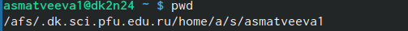
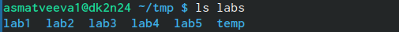
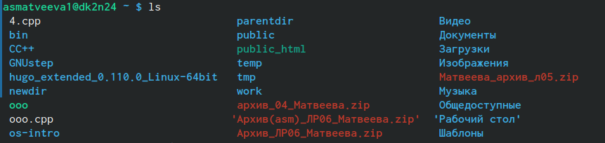
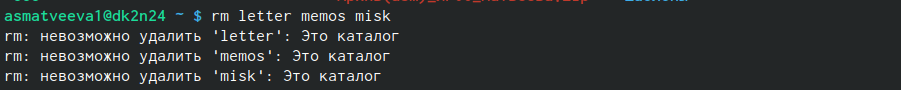
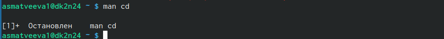
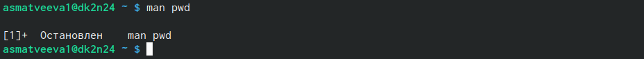

---
## Front matter
lang: ru-RU
title: Лабораторная работа №4 
subtitle: Основы интерфейса взаимодействия пользователя с системой Unix на уровне командной строки
author:
  - Матвеева А.С
institute:
  - Российский университет дружбы народов, Москва, Россия

## i18n babel
babel-lang: russian
babel-otherlangs: english

## Formatting pdf
toc: false
toc-title: Содержание
slide_level: 2
aspectratio: 169
section-titles: true
theme: metropolis
header-includes:
 - \metroset{progressbar=frametitle,sectionpage=progressbar,numbering=fraction}
 - '\makeatletter'
 - '\beamer@ignorenonframefalse'
 - '\makeatother'
---

# Информация

## Докладчик

:::::::::::::: {.columns align=center}
::: {.column width="70%"}

  * Матвеева Анастасия Сергеевна 
  * НБИ-02-22
  * РУДН 

:::
::: {.column width="30%"}

:::
::::::::::::::

## Цели и задачи

- Приобретение практических навыков взаимодействия пользователя с системой по-
средством командной строки.

## Этапы работы

1. Использование команды PDW

{#fig:001 width=90%}

##

2.Использования LS

{#fig:003 width=90%}

{#fig:004 width=90%}

{#fig:005 width=90%}

{#fig:007 width=90%}

{#fig:009 width=90%}

##

3. Команда CD

{#fig:002 width=90%}

{#fig:003 width=90%}

{#fig:010 width=90%}

##

4. mkdir 

{#fig:008 width=90%}

{#fig:011 width=90%}

##

5. rm

{#fig:014 width=90%}

{#fig:013 width=90%}

##

6. man 

{#fig:016 width=90%}

{#fig:018 width=90%}

{#fig:020 width=90%}

## Вывод 

- мы молодцы 

:::

