---
## Front matter
title: "Лабораторная рбота №4"
subtitle: "Основы интерфейса взаимодействия
пользователя с системой Unix на уровне командной строки"
author: "Матвеева Анастасия Сергеевна"

## Generic otions
lang: ru-RU
toc-title: "Содержание"

## Bibliography
bibliography: bib/cite.bib
csl: pandoc/csl/gost-r-7-0-5-2008-numeric.csl

## Pdf output format
toc: true # Table of contents
toc-depth: 2
lof: true # List of figures
lot: true # List of tables
fontsize: 12pt
linestretch: 1.5
papersize: a4
documentclass: scrreprt
## I18n polyglossia
polyglossia-lang:
  name: russian
  options:
	- spelling=modern
	- babelshorthands=true
polyglossia-otherlangs:
  name: english
## I18n babel
babel-lang: russian
babel-otherlangs: english
## Fonts
mainfont: PT Serif
romanfont: PT Serif
sansfont: PT Sans
monofont: PT Mono
mainfontoptions: Ligatures=TeX
romanfontoptions: Ligatures=TeX
sansfontoptions: Ligatures=TeX,Scale=MatchLowercase
monofontoptions: Scale=MatchLowercase,Scale=0.9
## Biblatex
biblatex: true
biblio-style: "gost-numeric"
biblatexoptions:
  - parentracker=true
  - backend=biber
  - hyperref=auto
  - language=auto
  - autolang=other*
  - citestyle=gost-numeric
## Pandoc-crossref LaTeX customization
figureTitle: "Рис."
tableTitle: "Таблица"
listingTitle: "Листинг"
lofTitle: "Список иллюстраций"
lotTitle: "Список таблиц"
lolTitle: "Листинги"
## Misc options
indent: true
header-includes:
  - \usepackage{indentfirst}
  - \usepackage{float} # keep figures where there are in the text
  - \floatplacement{figure}{H} # keep figures where there are in the text
---

# Цель работы

Приобретение практических навыков взаимодействия пользователя с системой по-
средством командной строки.

# Выполнение лабораторной работы

1. Определите полное имя вашего домашнего каталога. Далее относительно этого ката-
лога будут выполняться последующие упражнения.

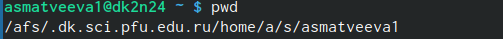{#fig:001 width=90%}

2. Перейдите в каталог /tmp.
 
{#fig:002 width=90%}

 3. Выведите на экран содержимое каталога /tmp
 
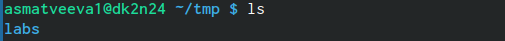{#fig:003 width=90%}

4. пределите, есть ли в каталоге /var/spool подкаталог с именем cron? Есть.
  
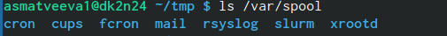{#fig:005 width=90%}  
  
5. Перейдите в Ваш домашний каталог и выведите на экран его содержимое. Опре-
делите, кто является владельцем файлов и подкаталогов

{#fig:006 width=90%}

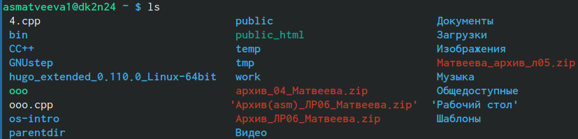{#fig:007 width=90%}
  
6.  В домашнем каталоге создайте новый каталог с именем newdir.
  
{#fig:008 width=90%}

7. В каталоге ~/newdir создайте новый каталог с именем morefun
  
{#fig:010 width=90%}

8. В домашнем каталоге создайте одной командой три новых каталога с именами
letters, memos, misk. Затем удалите эти каталоги одной командой.

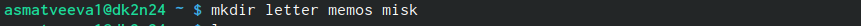{#fig:011 width=90%}

9. Попробуйте удалить ранее созданный каталог ~/newdir командой rm. Проверьте,
был ли каталог удалён.

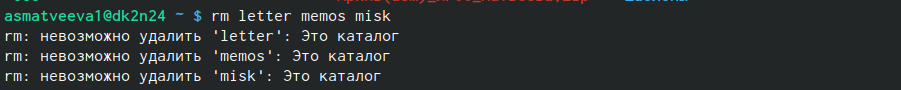{#fig:013 width=90%} 

10.  Удалите каталог ~/newdir/morefun из домашнего каталога. Проверьте, был ли
каталог удалён.

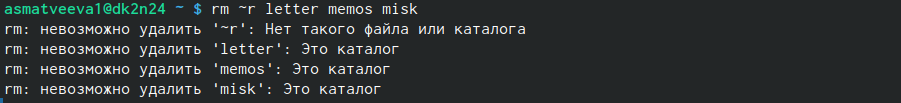{#fig:014 width=90%}

11. С помощью команды man определите, какую опцию команды ls нужно использо-
вать для просмотра содержимое не только указанного каталога, но и подкаталогов,
входящих в него.
 CD
 
 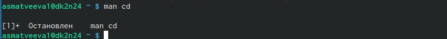{#fig:016 width=90%}
  
  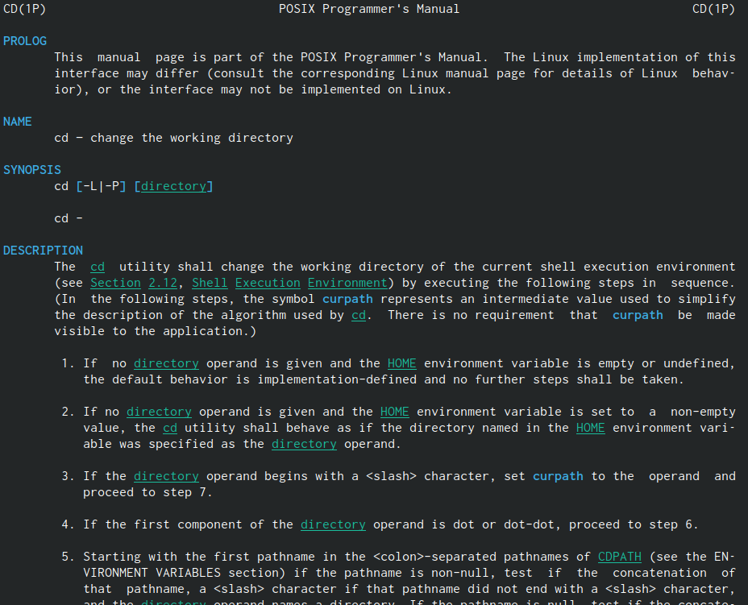{#fig:017 width=90%}
  
  PWD
  
  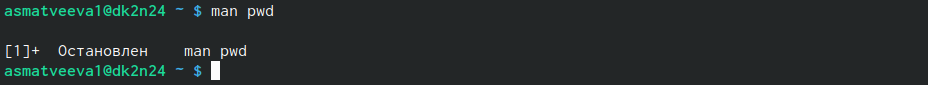{#fig:018 width=90%}
  
  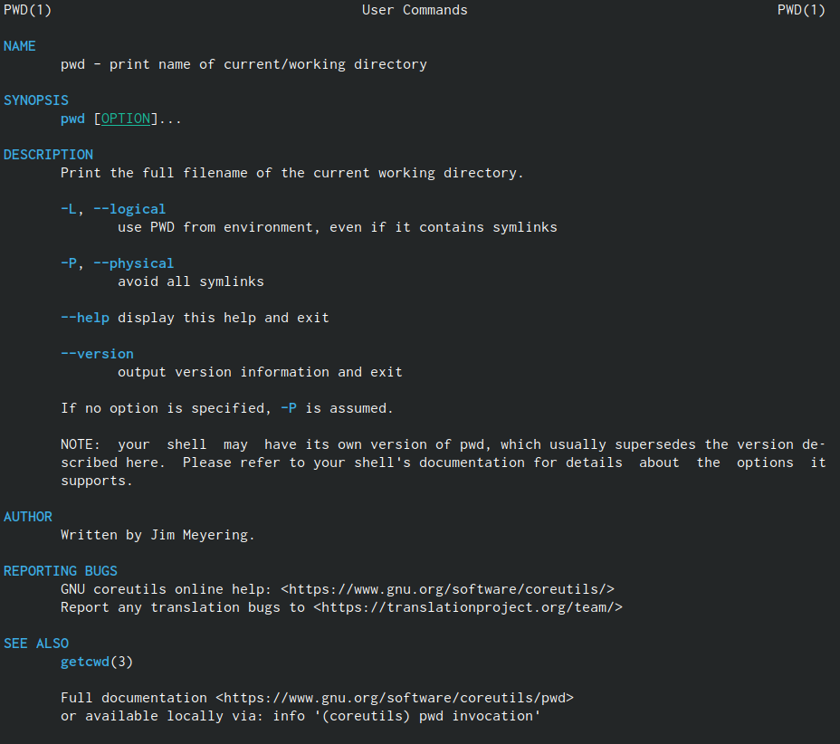{#fig:019 width=90%}
  
 MKDIR
 
 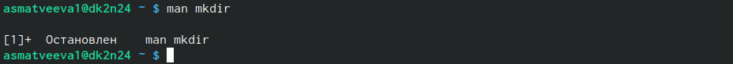{#fig:020 width=90%} 
  
  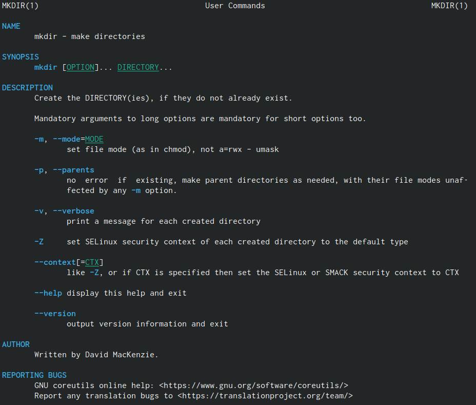{#fig:021 width=90%}
  
  RMDIR
  
  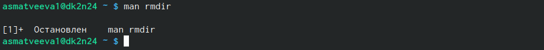{#fig:022 width=90%}
  
  {#fig:023 width=90%}
  
  RM
  
  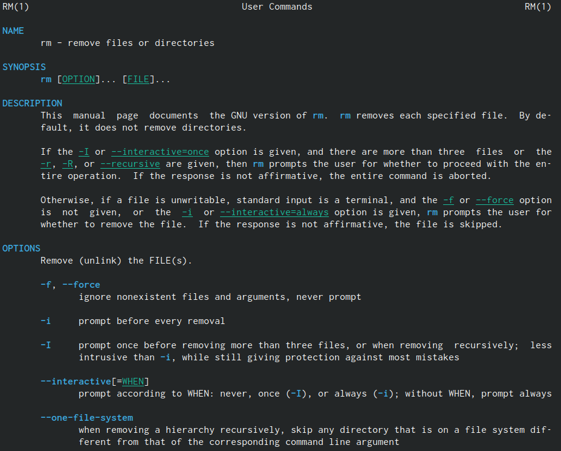{#fig:024 width=90%}
  
  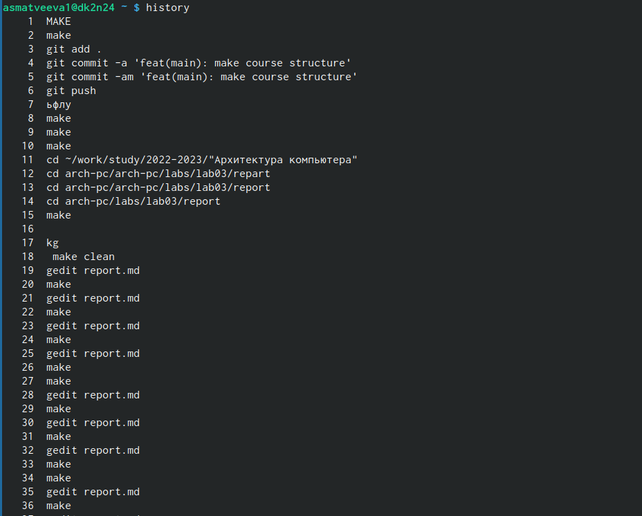{#fig:026 width=90%}
  
12. Используя информацию, полученную при помощи команды history, выполните мо-
дификацию и исполнение нескольких команд из буфера команд

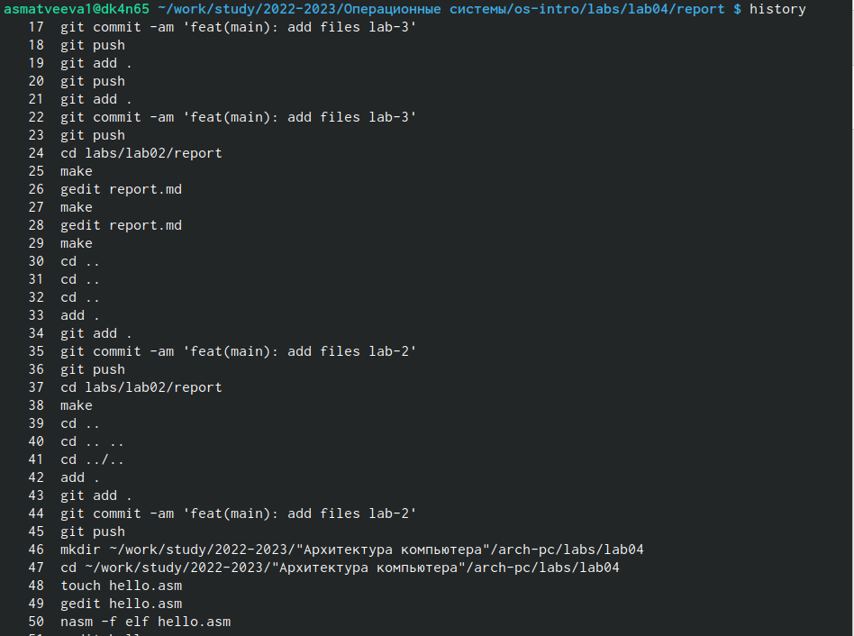{#fig:029 width=90%}
  
# Выводы

научились работать с системой посредством командной строки

# Список литературы{.unnumbered}

::: {#refs}
:::
