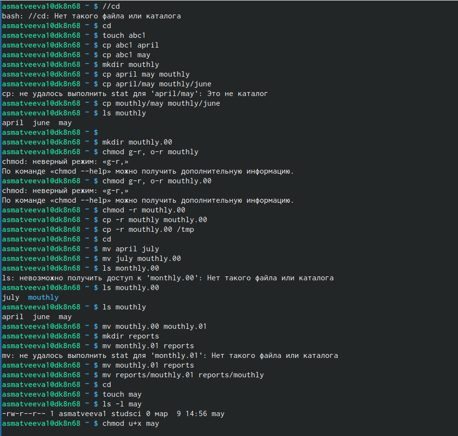
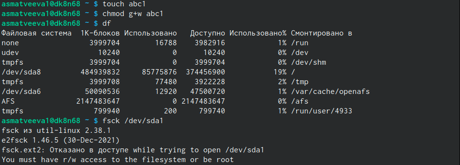
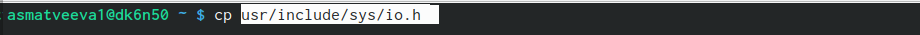
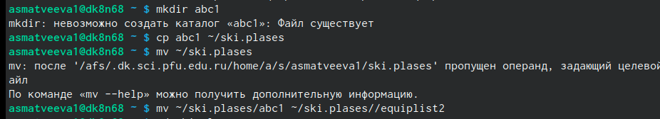
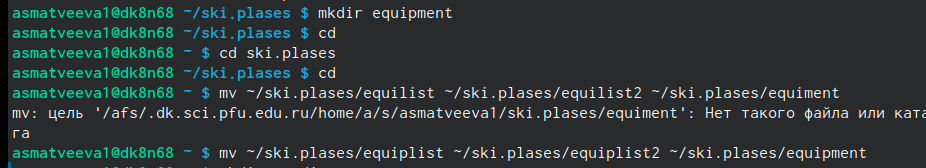
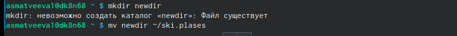
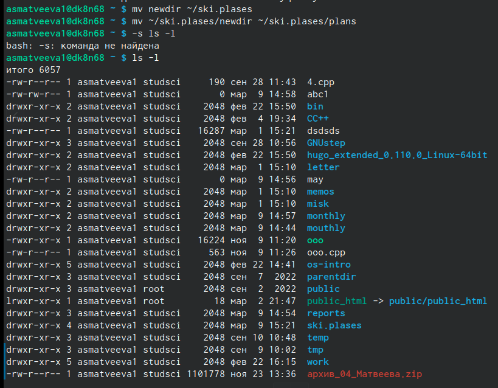
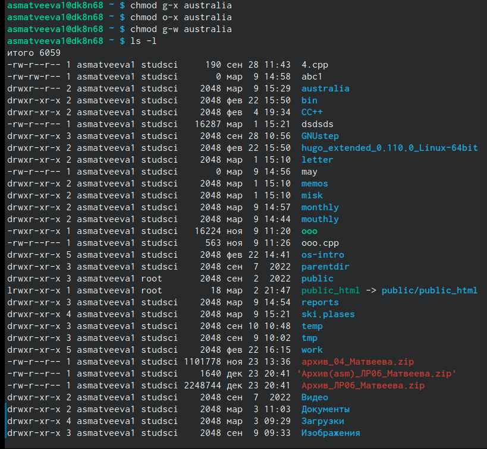
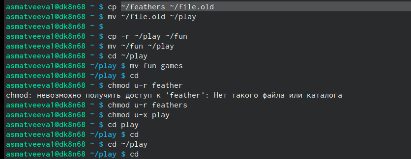
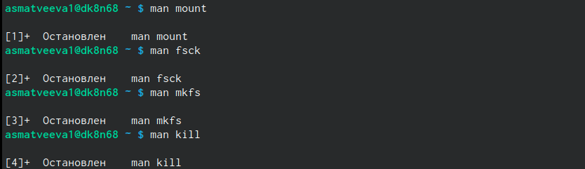

---
## Front matter
lang: ru-RU
title: Лабораторная работа №5 
subtitle: Анализ файловой системы Linux.Команды для работы с файлами и каталогами
author:
  - Матвеева А.С
institute:
  - Российский университет дружбы народов, Москва, Россия

## i18n babel
babel-lang: russian
babel-otherlangs: english

## Formatting pdf
toc: false
toc-title: Содержание
slide_level: 2
aspectratio: 169
section-titles: true
theme: metropolis
header-includes:
 - \metroset{progressbar=frametitle,sectionpage=progressbar,numbering=fraction}
 - '\makeatletter'
 - '\beamer@ignorenonframefalse'
 - '\makeatother'
---

# Информация

## Докладчик

:::::::::::::: {.columns align=center}
::: {.column width="70%"}

  * Матвеева Анастасия Сергеевна 
  * НБИ-02-22
  * РУДН 

:::
::: {.column width="30%"}

:::
::::::::::::::

## Цели и задачи

- Ознакомление с файловой системой Linux, её структурой, именами и содержанием каталогов. Приобретение практических навыков по применению команд для работы с файлами и каталогами, по управлению процессами (и работами), по проверке использования диска и обслуживанию файловой системы.

## Этапы работы

1. Выполните все примеры, приведённые в первой части описания лабораторной работы.
##
{#fig:001 width=90%}
##
2. Выполните следующие действия, зафиксировав в отчёте по лабораторной работе используемые при этом команды и результаты их выполнения:
 
{#fig:002 width=90%}
##
   1. Скопируйте файл /usr/include/sys/io.h в домашний каталог назовите его equipment
 
{#fig:003 width=90%}
##
   2. В домашнем каталоге создайте директорию ~/ski.plases.   
 
 {#fig:004 width=90%}
##
   3. Переместите файл equipment в каталог ~/ski.plases.
  
{#fig:005 width=90%}  
##
   4. Переименуйте файл ~/ski.plases/equipment в ~/ski.plases/equiplist.
  
  {#fig:006 width=90%}
##  
   5. Создайте в домашнем каталоге файл abc1 и скопируйте его в каталог
~/ski.plases, назовите его equiplist2.

{#fig:007 width=90%}
##
   6. cоздайте каталог с именем equipment в каталоге ~/ski.plases.Переместите файлы ~/ski.plases equiplist и equiplist2 в каталог ~/ski.plases/equipment.

  {#fig:009 width=90%}
## 
  7. Создайте и переместите каталог ~/newdir в каталог ~/ski.plases и назовите его plans.

{#fig:010 width=90%}

  {#fig:011 width=90%}

##
3.  Определите опции команды chmod, необходимые для того, чтобы присвоить перечисленным ниже файлам выделенные права доступа, считая, что в начале таких прав нет:
3.1. drwxr--r-- ... australia
3.2. drwx--x--x ... play
3.3. -r-xr--r-- ... my_os
3.4. -rw-rw-r-- ... feathers

{#fig:012 width=90%}

##
4.  Проделайте приведённые ниже упражнения, записывая в отчёт по лабораторной
работе используемые при этом команды:
4.1. Просмотрите содержимое файла /etc/password.
4.2. Скопируйте файл ~/feathers в файл ~/file.old.
4.3. Переместите файл ~/file.old в каталог ~/play.
4.4. Скопируйте каталог ~/play в каталог ~/fun.
4.5. Переместите каталог ~/fun в каталог ~/play и назовите его games.
4.6. Лишите владельца файла ~/feathers права на чтение.
4.7. Что произойдёт, если вы попытаетесь просмотреть файл ~/feathers командой
cat?
4.8. Что произойдёт, если вы попытаетесь скопировать файл ~/feathers?
4.9. Дайте владельцу файла ~/feathers право на чтение.
4.10. Лишите владельца каталога ~/play права на выполнение.
4.11. Перейдите в каталог ~/play. Что произошло?
4.12. Дайте владельцу каталога ~/play право на выполнение.
Все сделанно в одном скрине 

{#fig:013 width=90%} 
##
5.  Прочитайте man по командам mount, fsck, mkfs, kill и кратко их охарактеризуйте,
приведя примеры.

{#fig:014 width=90%}

## Вывод 

- мы молодцы 

:::

