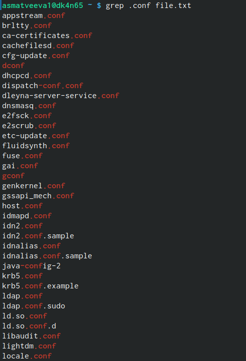
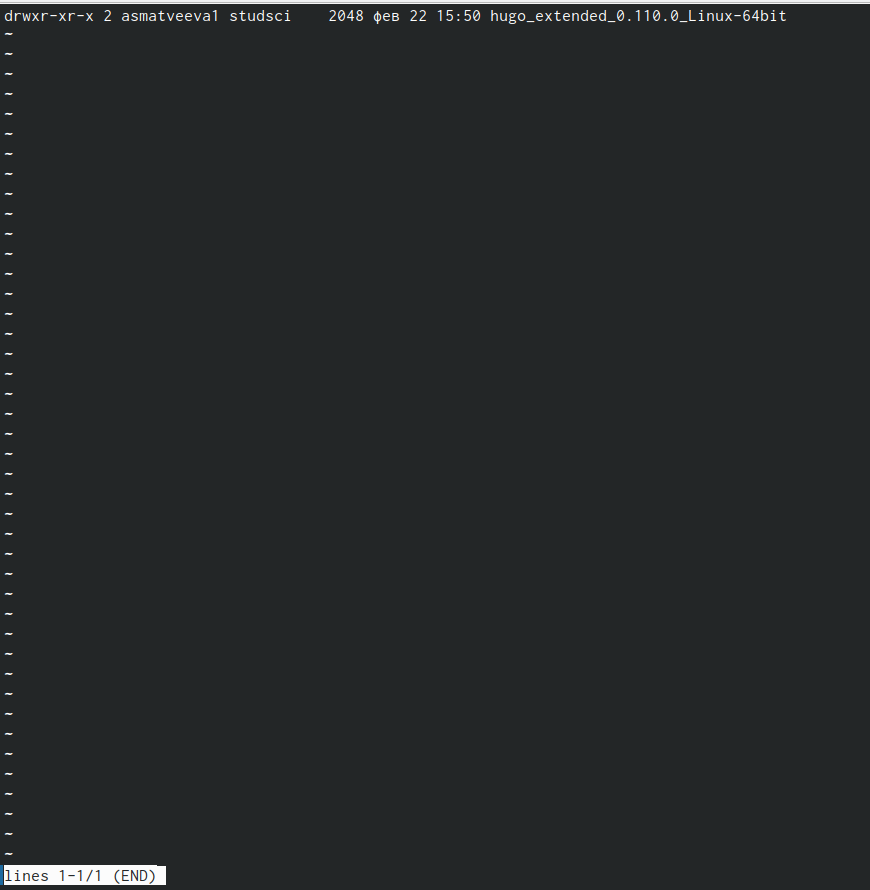
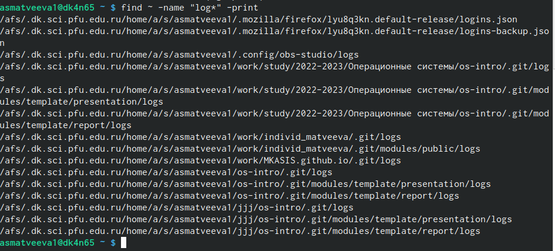
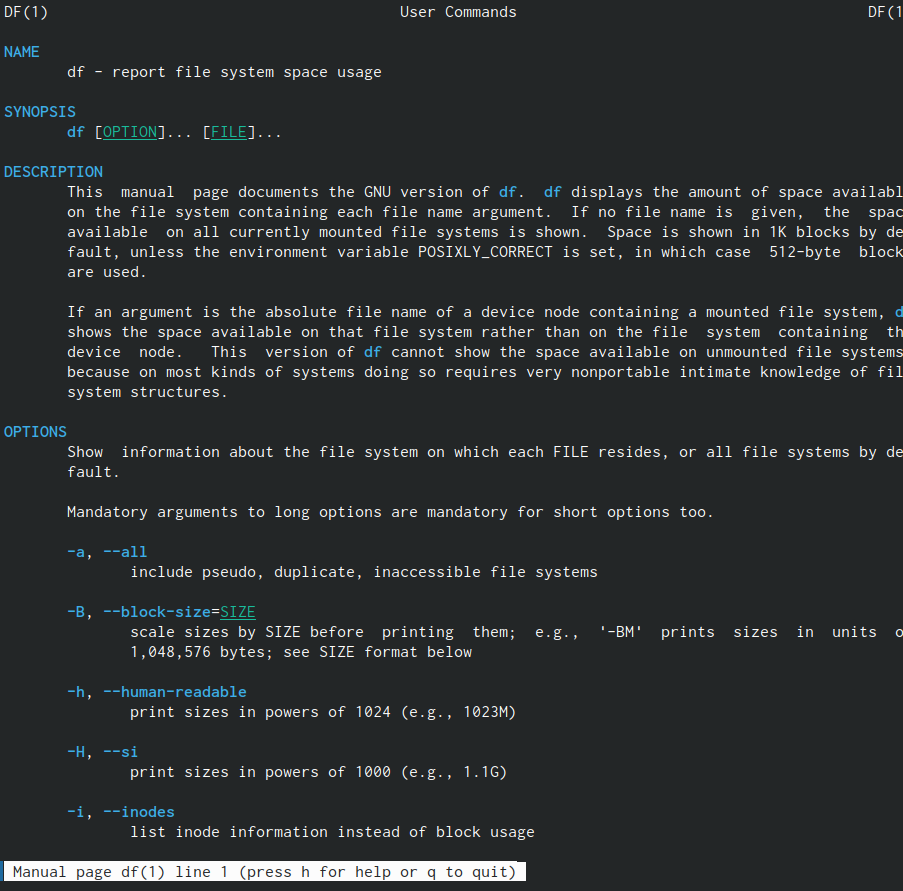
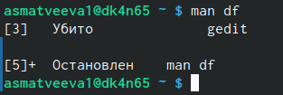

---
## Front matter
title: "Лабораторная рбота №6"
subtitle: "Анализ файловой системы Linux.Команды для работы с файлами и каталогами"
author: "Матвеева Анастасия Сергеевна"

## Generic otions
lang: ru-RU
toc-title: "Содержание"

## Bibliography
bibliography: bib/cite.bib
csl: pandoc/csl/gost-r-7-0-5-2008-numeric.csl

## Pdf output format
toc: true # Table of contents
toc-depth: 2
lof: true # List of figures
lot: true # List of tables
fontsize: 12pt
linestretch: 1.5
papersize: a4
documentclass: scrreprt
## I18n polyglossia
polyglossia-lang:
  name: russian
  options:
	- spelling=modern
	- babelshorthands=true
polyglossia-otherlangs:
  name: english
## I18n babel
babel-lang: russian
babel-otherlangs: english
## Fonts
mainfont: PT Serif
romanfont: PT Serif
sansfont: PT Sans
monofont: PT Mono
mainfontoptions: Ligatures=TeX
romanfontoptions: Ligatures=TeX
sansfontoptions: Ligatures=TeX,Scale=MatchLowercase
monofontoptions: Scale=MatchLowercase,Scale=0.9
## Biblatex
biblatex: true
biblio-style: "gost-numeric"
biblatexoptions:
  - parentracker=true
  - backend=biber
  - hyperref=auto
  - language=auto
  - autolang=other*
  - citestyle=gost-numeric
## Pandoc-crossref LaTeX customization
figureTitle: "Рис."
tableTitle: "Таблица"
listingTitle: "Листинг"
lofTitle: "Список иллюстраций"
lotTitle: "Список таблиц"
lolTitle: "Листинги"
## Misc options
indent: true
header-includes:
  - \usepackage{indentfirst}
  - \usepackage{float} # keep figures where there are in the text
  - \floatplacement{figure}{H} # keep figures where there are in the text
---

# Цель работы

Ознакомление с инструментами поиска файлов и фильтрации текстовых данных.
Приобретение практических навыков: по управлению процессами (и заданиями), по
проверке использования диска и обслуживанию файловых систем.

# Выполнение лабораторной работы

0. Осуществите вход в систему, используя соответствующее имя пользователя

1. Запишите в файл file.txt названия файлов, содержащихся в каталоге /etc. Допишите в этот же файл названия файлов, содержащихся в вашем домашнем каталоге.

{#fig:001 width=90%}

2. Выведите имена всех файлов из file.txt, имеющих расширение .conf, после чего запишите их в новый текстовой файл conf.txt
 
{#fig:002 width=90%}

 
 
{#fig:003 width=90%}
 
   3. Определите, какие файлы в вашем домашнем каталоге имеют имена, начинавшиеся с символа c? Предложите несколько вариантов, как это сделать
 
 {#fig:004 width=90%}

4. Выведите на экран (по странично) имена файлов из каталога /etc, начинающиеся с символа h.
  
{#fig:005 width=90%}  

   
  
  {#fig:006 width=90%}
  
   5. Запустите в фоновом режиме процесс, который будет записывать в файл ~/logfile файлы, имена которых начинаются с log.
   
{#fig:007 width=90%}

   6. Удалите файл ~/logfile.
   
   {#fig:008 width=90%}
    
  
 
  7. Запустите из консоли в фоновом режиме редактор gedit.
  
{#fig:009 width=90%}

8.  Определите идентификатор процесса gedit, используя команду ps, конвейер и фильтр grep. Как ещё можно определить идентификатор процесса?

{#fig:010 width=90%}
 

9.  Прочтите справку (man) команды kill после чего используйте её для завершения процесса gedit

 {#fig:011 width=90%}
 
 

10. Выполните команды df и du, предварительно получив более подробную информацию об этих командах, с помощью команды man.

 {#fig:012 width=90%}
 
 {#fig:013 width=90%} 
 
  {#fig:014 width=90%}
  
11. Воспользовавшись справкой команды find, выведите имена всех директорий, имеющихся в вашем домашнем каталоге

 {#fig:015 width=90%}

# Выводы

научились работать с файловой системой linux 

# Список литературы{.unnumbered}

::: {#refs}
:::
