---
## Front matter
lang: ru-RU
title: Лабораторная работа №7
subtitle: Поиск файлов.
author:
  - Матвеева А.С
institute:
  - Российский университет дружбы народов, Москва, Россия

## i18n babel
babel-lang: russian
babel-otherlangs: english

## Formatting pdf
toc: false
toc-title: Содержание
slide_level: 2
aspectratio: 169
section-titles: true
theme: metropolis
header-includes:
 - \metroset{progressbar=frametitle,sectionpage=progressbar,numbering=fraction}
 - '\makeatletter'
 - '\beamer@ignorenonframefalse'
 - '\makeatother'
---

# Информация

## Докладчик

:::::::::::::: {.columns align=center}
::: {.column width="70%"}

  * Матвеева Анастасия Сергеевна 
  * НБИ-02-22
  * РУДН 

:::
::: {.column width="30%"}

:::
::::::::::::::

## Цели и задачи

- Познакомиться с операционной системой Linux. Получить практические навыки рабо- ты с редактором vi, установленным по умолчанию практически во всех дистрибутивах.

## Этапы работы

0. Изучите информацию о mc, вызвав в командной строке man mc. Запустите из командной строки mc, изучите его структуру и меню

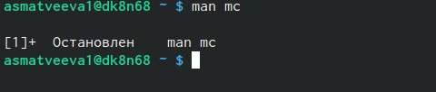{#fig:001 width=90%}

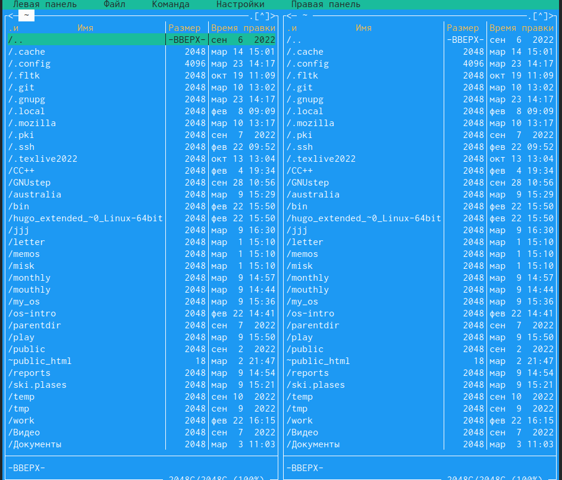{#fig:002 width=90%}

##
1. Создайте текстовой файл text.txt.Откройте этот файл с помощью встроенного в mc редактора

{#fig:003 width=90%}

##
2. Вставьте в открытый файл небольшой фрагмент текста, скопированный из любого другого файла или Интернета.
 
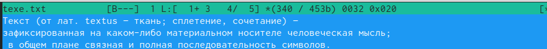{#fig:007 width=90%}
 
## 
 
3. Проделайте с текстом следующие манипуляции, используя горячие клавиши
 
 выделите фрагмент текста и скопируйте его на новую строку.
 
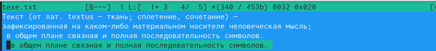{#fig:008 width=90%}

Выделите фрагмент текста и перенесите его на новую строку.

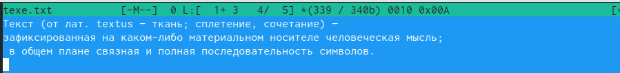{#fig:009 width=90%}

Сохраните файл

  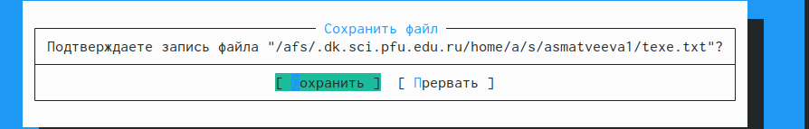{#fig:006 width=90%}
  
  Перейдите в конец файла (нажав комбинацию клавиш) и напишите некоторый
текст.
  Перейдите в начало файла (нажав комбинацию клавиш) и напишите некоторый
текст.
 
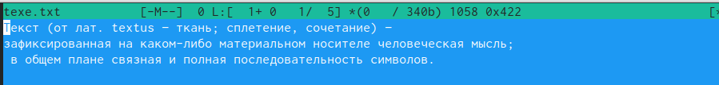{#fig:010 width=90%}
 
 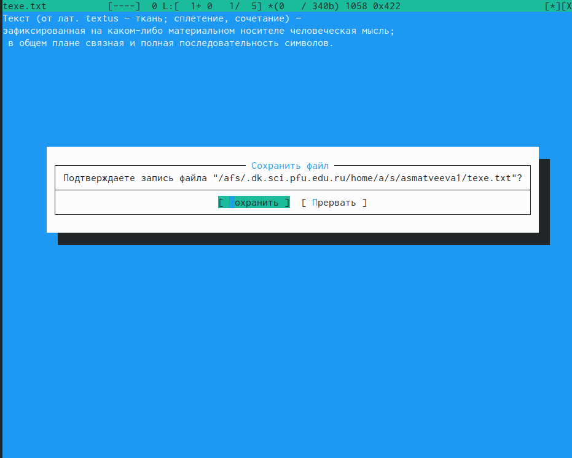{#fig:011 width=90%}
 

 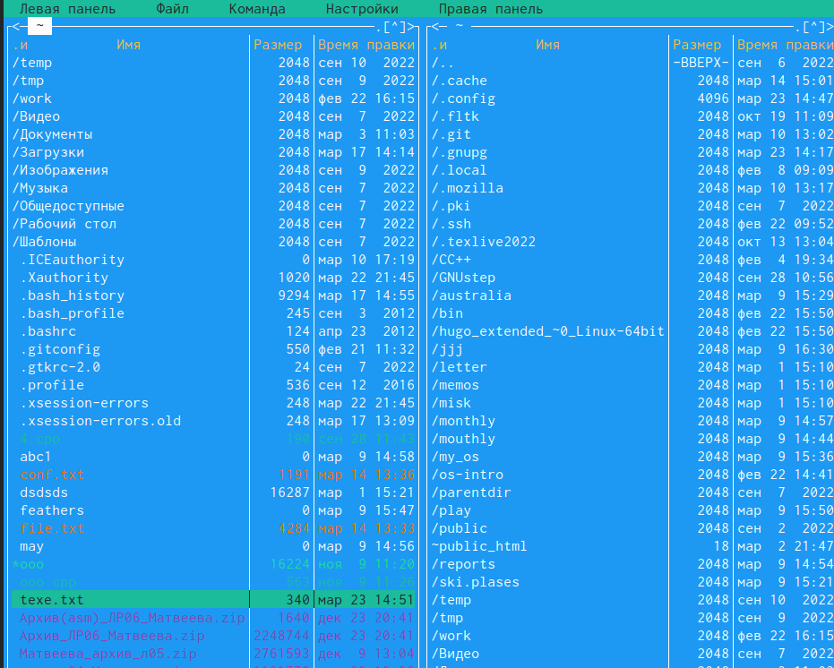{#fig:012 width=90%}
 
## 
 
 5. Откройте файл с исходным текстом на некотором языке программирования (напри-
мер C или Java
 
 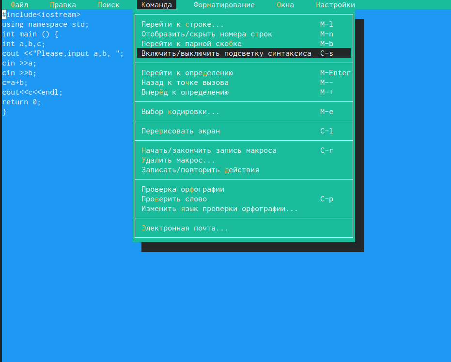{#fig:013 width=90%} 
 
  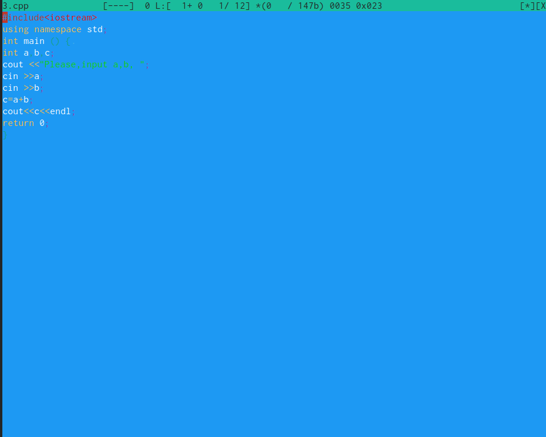{#fig:014 width=90%}
  

## Вывод 

- мы молодцы 

:::

