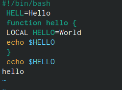

---
## Front matter
lang: ru-RU
title: Лабораторная работа №8
subtitle: Поиск файлов.
author:
  - Матвеева А.С
institute:
  - Российский университет дружбы народов, Москва, Россия

## i18n babel
babel-lang: russian
babel-otherlangs: english

## Formatting pdf
toc: false
toc-title: Содержание
slide_level: 2
aspectratio: 169
section-titles: true
theme: metropolis
header-includes:
 - \metroset{progressbar=frametitle,sectionpage=progressbar,numbering=fraction}
 - '\makeatletter'
 - '\beamer@ignorenonframefalse'
 - '\makeatother'
---

# Информация

## Докладчик

:::::::::::::: {.columns align=center}
::: {.column width="70%"}

  * Матвеева Анастасия Сергеевна 
  * НБИ-02-22
  * РУДН 

:::
::: {.column width="30%"}

:::
::::::::::::::

## Цели и задачи

- Познакомиться с операционной системой Linux. Получить практические навыки рабо- ты с редактором vi, установленным по умолчанию практически во всех дистрибутивах.

## Этапы работы

1.  cоздайте каталог с именем ~/work/os/lab08
    Перейдите во вновь созданный каталог.
    Вызовите vi и создайте файл hello.sh

{#fig:001 width=90%}

##

2. нажмите клавишу i и вводите следующий текст
 
{#fig:002 width=90%}

##

3. Нажмите клавишу Esc для перехода в командный режим после завершения ввода текста. Нажмите : для перехода в режим последней строки и внизу вашего экрана появитсяи приглашение в виде двоеточия.  Нажмите w (записать) и q (выйти), а затем нажмите клавишу Enter для сохранения вашего текста и завершения работы'

 {#fig:011 width=90%}
 
##

4. Сделайте файл исполняемым
 
{#fig:003 width=90%}

##

5. вызовите vi на редактирование файла

{#fig:003 width=90%}

##

6. Перейдите в режим вставки и замените на HELLO.. Нажмите Esc для возврата в командный режим.

{#fig:004 width=90%}
   
{#fig:005 width=90%}

##

7. становите курсор на четвертую строку и сотрите слово LOCAL. Перейдите в режим вставки и наберите следующий текст: local, нажмите Esc для возврата в командный режим

   {#fig:006 width=90%}
   
    {#fig:007 width=90%}
8. Установите курсор на последней строке файла. Вставьте после неё строку, содержащую следующий текст: echo $HELLO

{#fig:008 width=90%}

##

9. удалите последнюю строку.  Введите команду отмены изменений u для отмены последней команды

{#fig:009 width=90%}

{#fig:010 width=90%}

##

10. Введите символ : для перехода в режим последней строки. Запишите произведённые изменения и выйдите из vi.

## Вывод 

- мы молодцы 

:::

