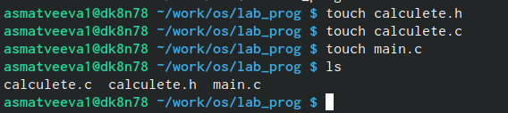
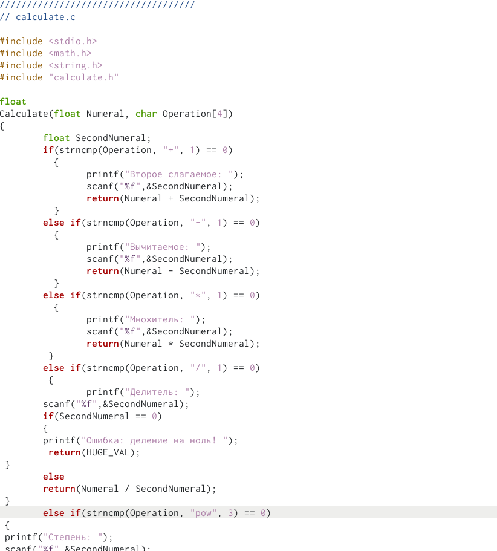
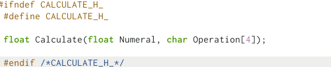
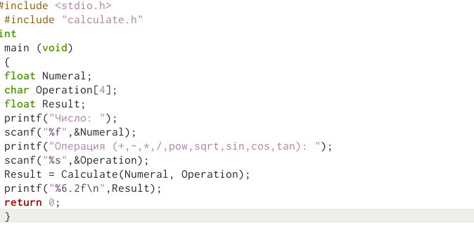
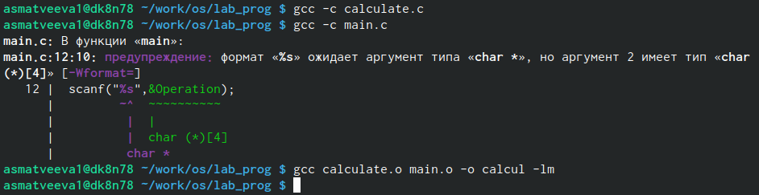
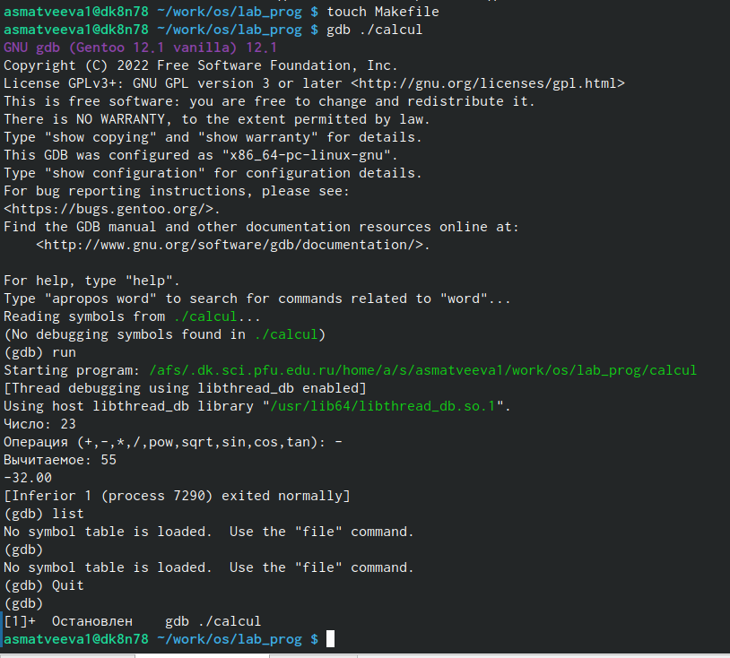
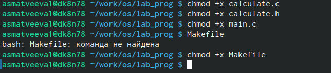

---
## Front matter
lang: ru-RU
title: Лабораторная работа №13
subtitle: Поиск файлов.
author:
  - Матвеева А.С
institute:
  - Российский университет дружбы народов, Москва, Россия

## i18n babel
babel-lang: russian
babel-otherlangs: english

## Formatting pdf
toc: false
toc-title: Содержание
slide_level: 2
aspectratio: 169
section-titles: true
theme: metropolis
header-includes:
 - \metroset{progressbar=frametitle,sectionpage=progressbar,numbering=fraction}
 - '\makeatletter'
 - '\beamer@ignorenonframefalse'
 - '\makeatother'
---

# Информация

## Докладчик

:::::::::::::: {.columns align=center}
::: {.column width="70%"}

  * Матвеева Анастасия Сергеевна 
  * НБИ-02-22
  * РУДН 

:::
::: {.column width="30%"}

:::
::::::::::::::

## Цели и задачи

- Приобрести простейшие навыки разработки, анализа, тестирования и отладки приложений в ОС типа UNIX/Linux на примере создания на языке программирования С калькулятора с простейшими функциями.

## Этапы работы

1. В домашнем каталоге создайте подкаталог ~/work/os/lab_prog.

{#fig:001 width=90%}

##

2. оздайте в нём файлы: calculate.h, calculate.c, main.c. Это будет примитивнейший калькулятор, способный складывать, вычитать, умножать и делить, возводить число в степень, брать квадратный корень, вычислять sin, cos, tan. При запуске он будет запрашивать первое число, операцию, второе число. После этого программа выведет результат и остановится. Реализация функций калькулятора в файле calculate.c

##

{#fig:002 width=90%}

##

{#fig:003 width=90%} 

##

3. Интерфейсный файл calculate.h, описывающий формат вызова функции калькулятора:

{#fig:004 width=90%}

##

4. Основной файл main.c, реализующий интерфейс пользователя к калькулятору:

{#fig:005 width=90%}

##

5. Выполните компиляцию программы посредством gcc:

{#fig:006 width=90%}

##

6. Создайте Makefile со следующим содержанием. С помощью gdb выполните отладку программы calcul:
– Запустите отладчик GDB, загрузив в него программу для отладки
– Для запуска программы внутри отладчика введите команду run: 

##

{#fig:007 width=90%} 

##

7. С помощью утилиты splint попробуйте проанализировать коды файлов calculate.c и main.c.

{#fig:008 width=90%}

## Вывод 

- Приобрели простейшие навыки рзработки анализа, тестирования и отладки приложений в ОС типа UNIX/Linux на примере создания на языке программирования С калькулятора с простейшими функциями

:::

