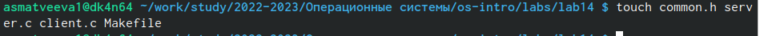
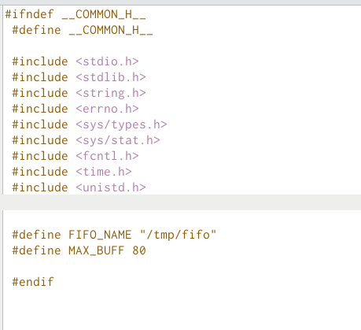
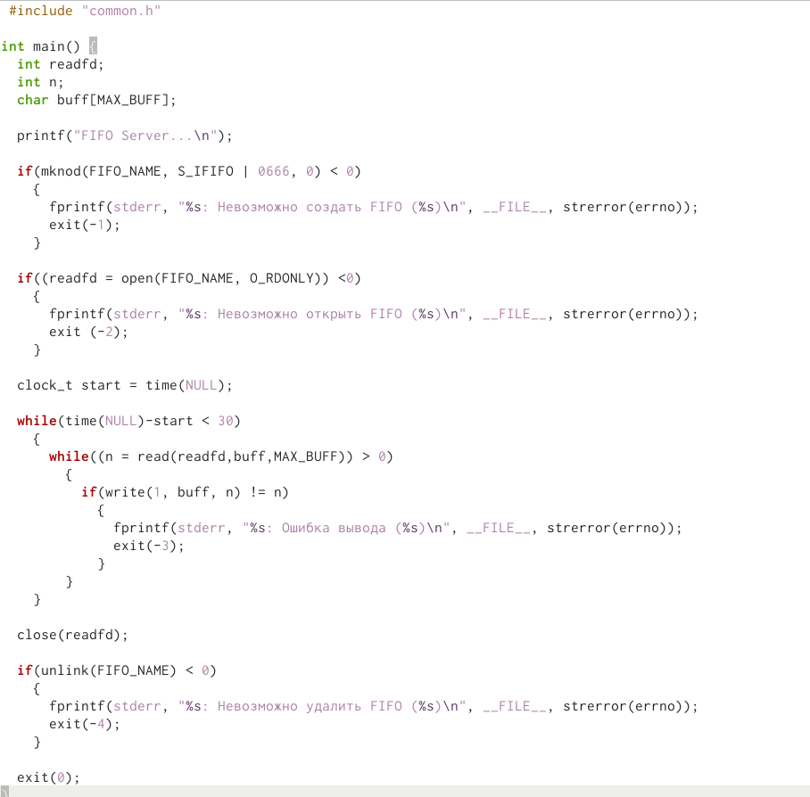
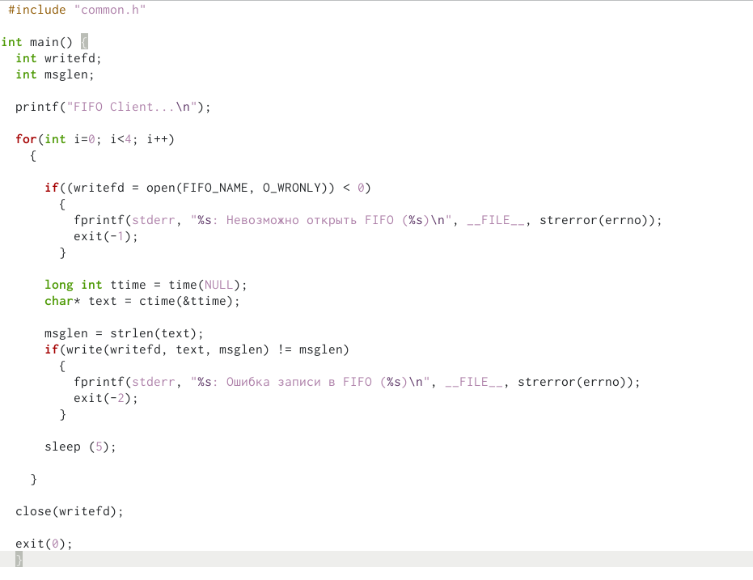
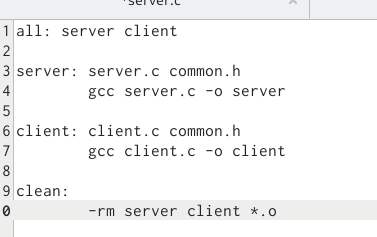
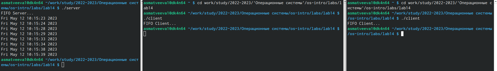

---
## Front matter
lang: ru-RU
title: Лабораторная работа №14
subtitle: Поиск файлов.
author:
  - Матвеева А.С
institute:
  - Российский университет дружбы народов, Москва, Россия

## i18n babel
babel-lang: russian
babel-otherlangs: english

## Formatting pdf
toc: false
toc-title: Содержание
slide_level: 2
aspectratio: 169
section-titles: true
theme: metropolis
header-includes:
 - \metroset{progressbar=frametitle,sectionpage=progressbar,numbering=fraction}
 - '\makeatletter'
 - '\beamer@ignorenonframefalse'
 - '\makeatother'
---

# Информация

## Докладчик

:::::::::::::: {.columns align=center}
::: {.column width="70%"}

  * Матвеева Анастасия Сергеевна 
  * НБИ-02-22
  * РУДН 

:::
::: {.column width="30%"}

:::
::::::::::::::

## Цели и задачи

-Приобретение практических навыков работы с именованными каналами.

## Этапы работы

0. Создать файлы  

{#fig:001 width=90%}

##

1. аботает не 1 клиент, а несколько (например, два).

{#fig:002 width=90%}

##

2. Клиенты передают текущее время с некоторой периодичностью (например, раз в пять
секунд). Используйте функцию sleep() для приостановки работы клиента.

{#fig:003 width=90%} 

##

{#fig:004 width=90%}

##

3. Сервер работает не бесконечно, а прекращает работу через некоторое время (например, 30 сек). Используйте функцию clock() для определения времени работы сервера. Что будет в случае, если сервер завершит работу, не закрыв канал?

{#fig:005 width=90%}

##

{#fig:006 width=90%}

## Вывод 

- Приобрели простейшие навыки Именованния каналов
:::

