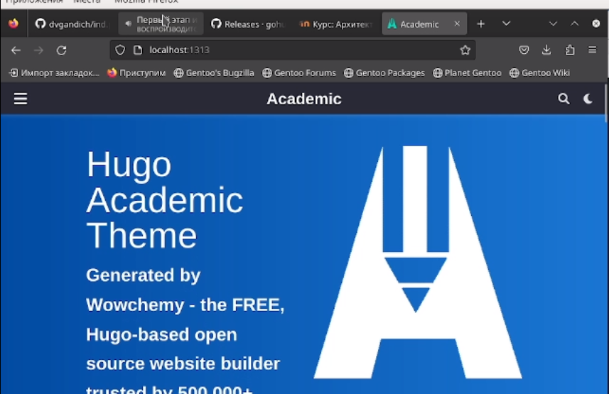

---
## Front matter
title: "Индивидуальный проект"
subtitle: "Этап 1"
author: "Матвеева Анастасия Сергеевна"

## Generic otions
lang: ru-RU
toc-title: "Содержание"

## Bibliography
bibliography: bib/cite.bib
csl: pandoc/csl/gost-r-7-0-5-2008-numeric.csl

## Pdf output format
toc: true # Table of contents
toc-depth: 2
lof: true # List of figures
lot: true # List of tables
fontsize: 12pt
linestretch: 1.5
papersize: a4
documentclass: scrreprt
## I18n polyglossia
polyglossia-lang:
  name: russian
  options:
	- spelling=modern
	- babelshorthands=true
polyglossia-otherlangs:
  name: english
## I18n babel
babel-lang: russian
babel-otherlangs: english
## Fonts
mainfont: PT Serif
romanfont: PT Serif
sansfont: PT Sans
monofont: PT Mono
mainfontoptions: Ligatures=TeX
romanfontoptions: Ligatures=TeX
sansfontoptions: Ligatures=TeX,Scale=MatchLowercase
monofontoptions: Scale=MatchLowercase,Scale=0.9
## Biblatex
biblatex: true
biblio-style: "gost-numeric"
biblatexoptions:
  - parentracker=true
  - backend=biber
  - hyperref=auto
  - language=auto
  - autolang=other*
  - citestyle=gost-numeric
## Pandoc-crossref LaTeX customization
figureTitle: "Рис."
tableTitle: "Таблица"
listingTitle: "Листинг"
lofTitle: "Список иллюстраций"
lotTitle: "Список таблиц"
lolTitle: "Листинги"
## Misc options
indent: true
header-includes:
  - \usepackage{indentfirst}
  - \usepackage{float} # keep figures where there are in the text
  - \floatplacement{figure}{H} # keep figures where there are in the text
---

# Цель работы

Первоэтапная настройка личнного сайта

# Выполнение лабораторной работы

1. Скачиваем исполняемый файл HUGO через гитхаб

{#fig:001 width=90%}

2. Оставляем только исполняемый файл 

{#fig:002 width=90%}

3. Создаем репозиторий  при помощи шаблона 

{#fig:003 width=90%}

4. Клонируем репозиторий  

{#fig:004 width=90%}

5. переходим в каталог и  проверяем файлы 

 {#fig:005 width=90%}
 
6. Прописываем команду и удаляем каталог public

{#fig:006 width=90%}
 удалиляем
{#fig:007 width=90%}

7. Выполням hugo server и там получаем ссылку на сайт 

{#fig:009 width=90%}
 переходим на сайт 
{#fig:066 width=90%}

8. Создаем еще один репозиторий с специальным названием ваше имя.гитхаб.ио

{#fig:088 width=90%}

9. проверяем блок "ls"

{#fig:013 width=90%}

10. клонируем репозиторий 

{#fig:012 width=90%}

11. Проверяем 

{#fig:013 width=90%}

12. переходим в каталог. используем команду checkout с ее помощью мы создаем ветку main. Дальше создаем файл README.md. И добовляем в гитхаб

{#fig:014 width=90%}

13. Проверяем ветку 

{#fig:015 width=90%}

14. прикрепряем его к нашемк репозиторию, так же автоматически создаеться каталог public

{#fig:016 width=90%}

15. В гитигнор добавляем перед public "#"

{#fig:017 width=90%}

16. повторяем команду из пункта 14

17. Синхронизировать файлы с нашем репозиторием 

{#fig:018 width=90%}
{#fig:019 width=90%}

18. Проверяем наш сайт и на этом конец 

# Выводы

Мы создали свой сайт 

# Список литературы{.unnumbered}

::: {#refs}
:::
