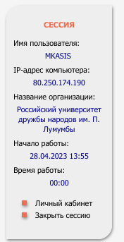
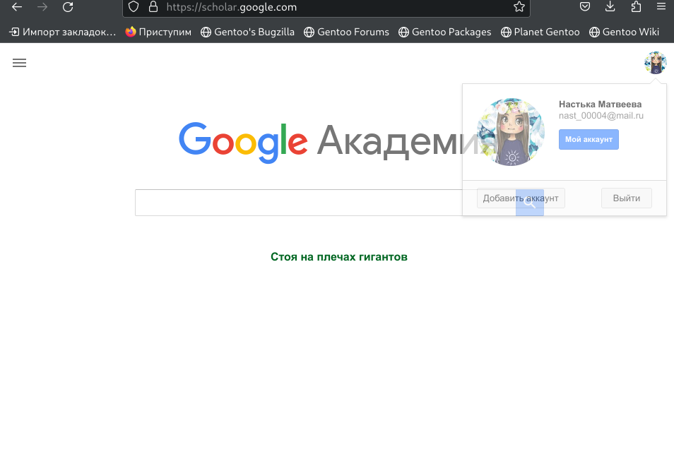
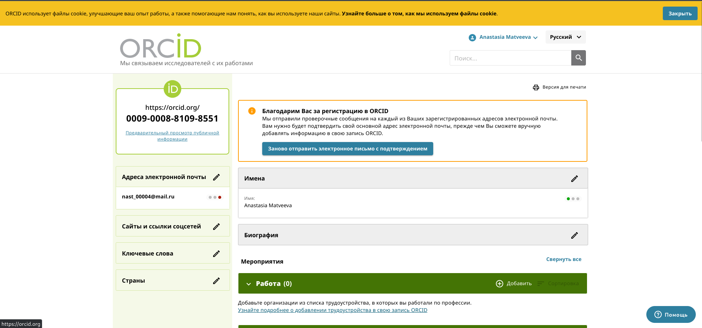
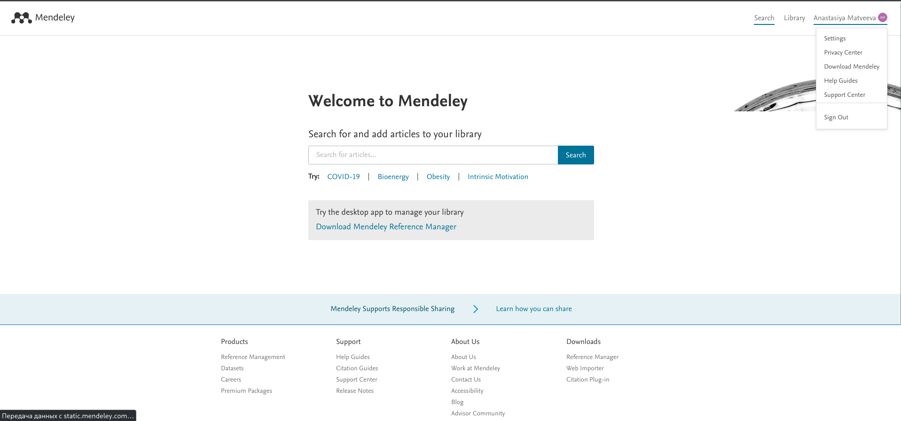
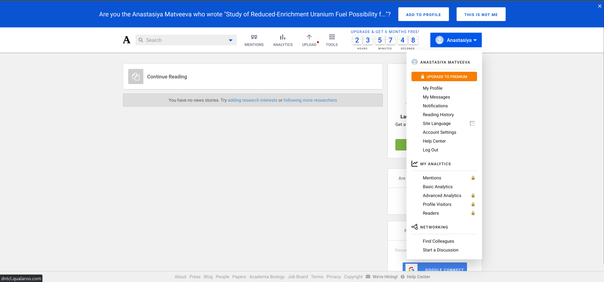
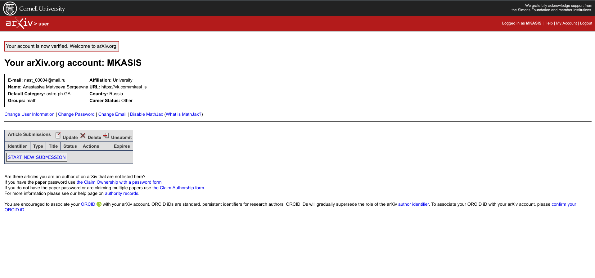
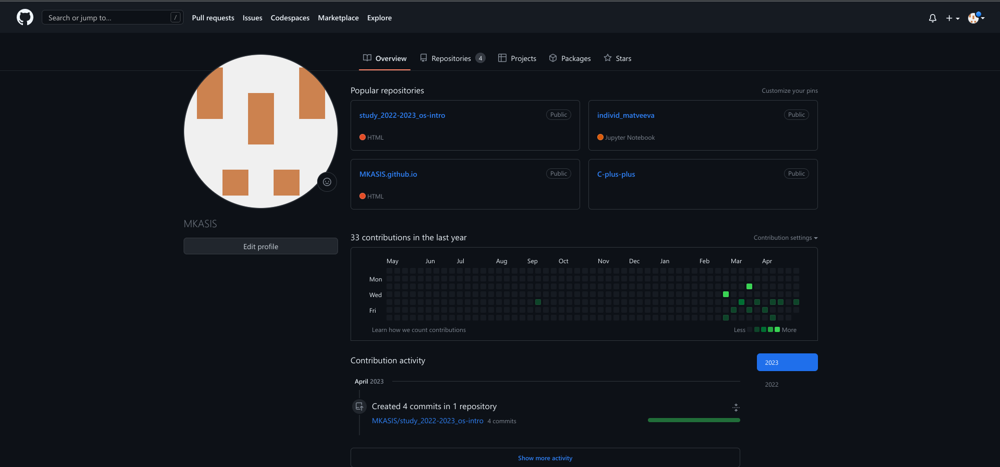
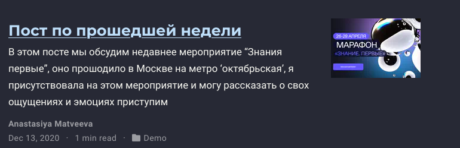

---
## Front matter
lang: ru-RU
title: индивидуальный проект 
subtitle: Этап 1
author:
  - Матвеева А.С
institute:
  - Российский университет дружбы народов, Москва, Россия

## i18n babel
babel-lang: russian
babel-otherlangs: english

## Formatting pdf
toc: false
toc-title: Содержание
slide_level: 2
aspectratio: 169
section-titles: true
theme: metropolis
header-includes:
 - \metroset{progressbar=frametitle,sectionpage=progressbar,numbering=fraction}
 - '\makeatletter'
 - '\beamer@ignorenonframefalse'
 - '\makeatother'
---

# Информация

## Докладчик

:::::::::::::: {.columns align=center}
::: {.column width="70%"}

  * Матвеева Анастасия Сергеевна 
  * НБИ-02-22
  * РУДН 

:::
::: {.column width="30%"}

:::
::::::::::::::

## Актуальность

- Рассказываю про вополнение индвидуального проекта 
- Необходимо создавать презентацию быстро
- Желательна минимизация усилий для создания презентации

## Объект и предмет исследования

- Презентация как текст
- Программное обеспечение для создания презентаций
- Входные и выходные форматы презентаций

## Цели и задачи

- создать презинтацию для защиты индивидуального проекта 

## Этапы работы

0. Зарегистрироваться на соответствующих ресурсах и разместить на них ссылки на сайте

##

1. eLibrary : https://elibrary.ru/;

{#fig:001 width=90%}

##

2. Google Scholar : https://scholar.google.com/;

{#fig:002 width=90%}

##

3. ORCID : https://orcid.org/;

{#fig:003 width=90%}

##

4. Mendeley : https://www.mendeley.com/;

{#fig:004 width=90%}

##

5. ResearchGate : https://www.researchgate.net/;

 {#fig:005 width=90%}

##
 
6. Academia.edu : https://www.academia.edu/;ъ

{#fig:006 width=90%}

##
 
7. arXiv : https://arxiv.org/;
 
{#fig:007 width=90%}

##

8. github : https://github.com/.

{#fig:008 width=90%}

##

9. Сделать пост по прошедшей неделе.

{#fig:009 width=90%}

## Вывод 

- Мы смогли научитаться создавать свой сайт и сортировать в нем файлы 

:::

