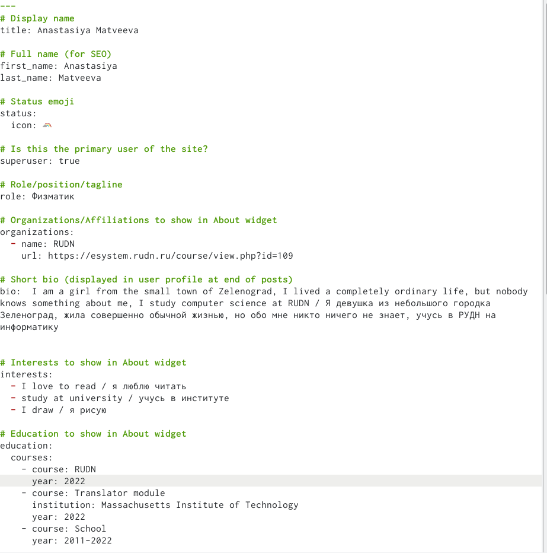
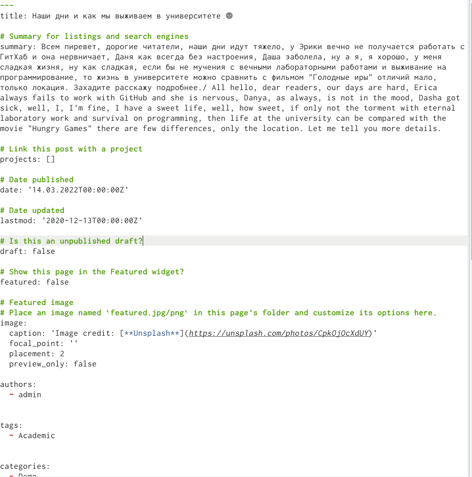
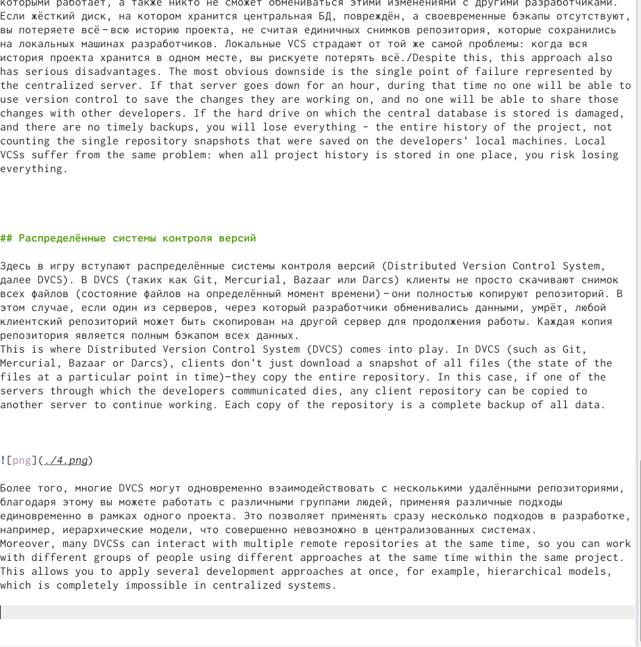
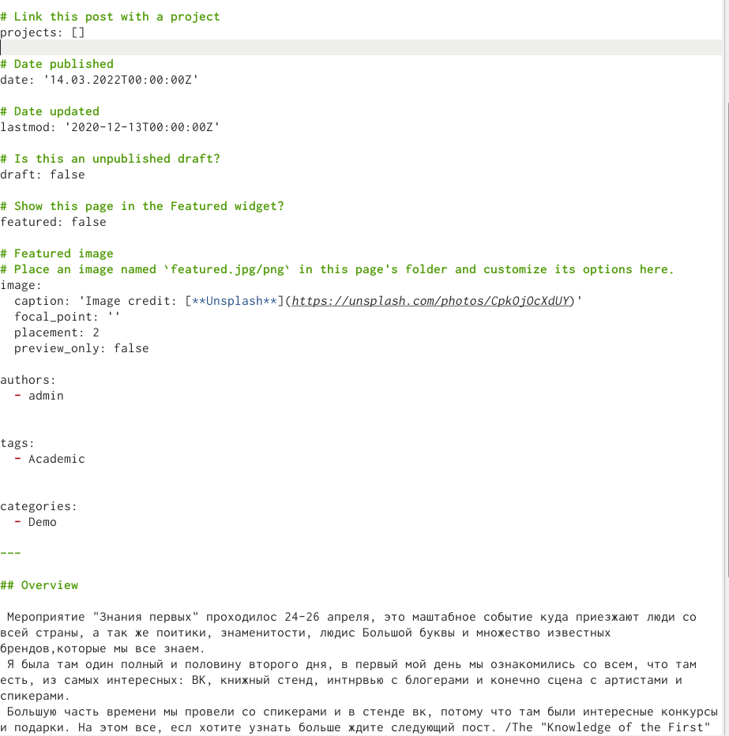
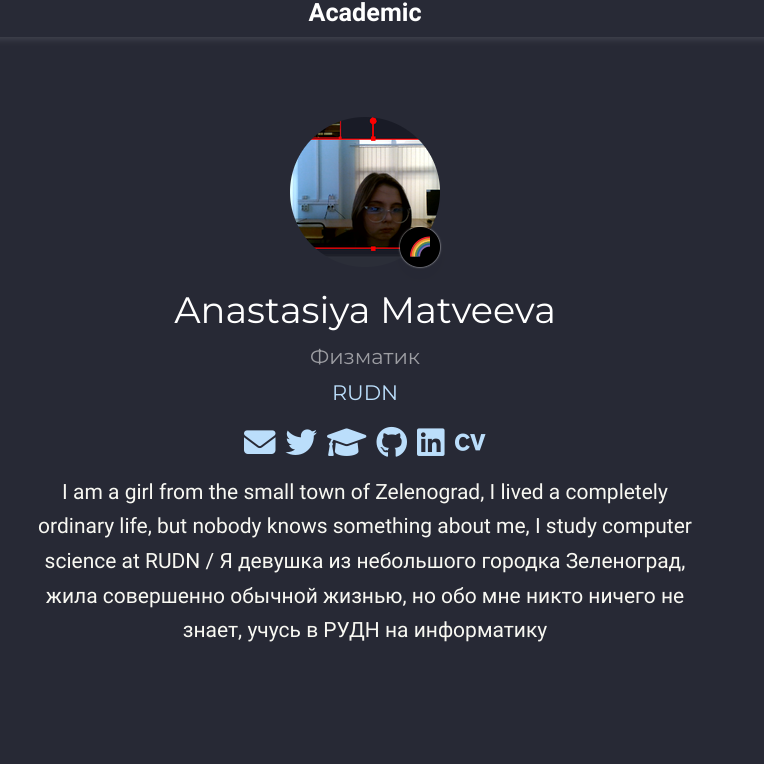

---
## Front matter
lang: ru-RU
title: индивидуальный проект 
subtitle: Этап 4
author:
  - Матвеева А.С
institute:
  - Российский университет дружбы народов, Москва, Россия

## i18n babel
babel-lang: russian
babel-otherlangs: english

## Formatting pdf
toc: false
toc-title: Содержание
slide_level: 2
aspectratio: 169
section-titles: true
theme: metropolis
header-includes:
 - \metroset{progressbar=frametitle,sectionpage=progressbar,numbering=fraction}
 - '\makeatletter'
 - '\beamer@ignorenonframefalse'
 - '\makeatother'
---

# Информация

## Докладчик

:::::::::::::: {.columns align=center}
::: {.column width="70%"}

  * Матвеева Анастасия Сергеевна 
  * НБИ-02-22
  * РУДН 

:::
::: {.column width="30%"}

:::
::::::::::::::

## Актуальность

- Рассказываю про вополнение индвидуального проекта 
- Необходимо создавать презентацию быстро
- Желательна минимизация усилий для создания презентации

## Объект и предмет исследования

- Презентация как текст
- Программное обеспечение для создания презентаций
- Входные и выходные форматы презентаций

## Цели и задачи

- Зарегестрироваться на сайтах и написать пост 

## Этапы работы

1. Сделать поддержку английского и русского языков.

{#fig:001 width=90%}

2. Разместить элементы сайта на обоих языках.

{#fig:002 width=90%}

3. Разместить контент на обоих языках.

{#fig:003 width=90%}

4. Сделать пост по прошедшей неделе.

{#fig:004 width=90%}

5. Добавить пост на тему по выбору (на двух языках).

 {#fig:005 width=90%}

## Вывод 

- Мы смогли научитаться создавать свой сайт и сортировать в нем файлы 

:::

